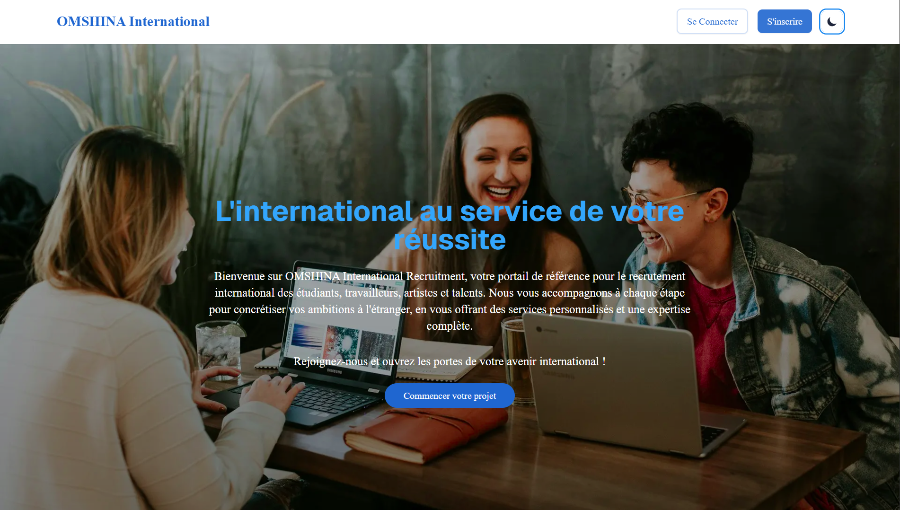

# OMSHINA International Recruitment

OMSHINA International Recruitment est une plateforme multiservice de recrutement international dédiée aux étudiants, travailleurs, artistes/talents et autres profils. Notre mission est de faciliter la mobilité internationale en accompagnant divers profils dans leurs démarches de recrutement et d'intégration à l'étranger.



## 🌟 Fonctionnalités principales

### Multi-profils

- **Étudiants**: Gestion des candidatures pour les programmes d'études à l'étranger
- **Travailleurs**: Suivi des démarches pour le recrutement professionnel
- **Artistes/Talents**: Plateforme dédiée incluant gestion de portfolio
- **Autres profils**: Espace personnalisé pour tout autre type de mobilité internationale

### Tableau de bord personnalisé

- Interface adaptée à chaque type d'utilisateur
- Vue centralisée des documents, candidatures et messages
- Gestion de l'état d'avancement des dossiers

### Gestion de documents

- Téléversement et stockage sécurisé des documents requis
- Suivi de l'état des documents (approuvé, en attente, rejeté)
- Feedback détaillé sur les documents

### Système de communication

- Messagerie intégrée entre utilisateurs et administrateurs
- Entretiens vidéo via Jitsi Meet
- Notifications en temps réel

### Espace administrateur

- Gestion complète des utilisateurs
- Suivi des candidatures
- Tableau de bord analytique avec statistiques
- Gestion des entretiens vidéo

## 🛠️ Technologies utilisées

- **Frontend**:

  - Next.js 15.2 (App Router)
  - TypeScript
  - TailwindCSS pour le styling
  - GSAP pour les animations
  - Recharts pour les graphiques statistiques

- **Intégrations**:
  - Jitsi Meet pour les appels vidéo
- **Futur Backend** (prévu):
  - Firebase Authentication
  - Firestore
  - Firebase Storage
  - Firebase Cloud Functions

## 📋 Prérequis

- Node.js (v18 ou supérieur)
- npm (v9 ou supérieur)

## 🚀 Installation

1. **Cloner le dépôt**

   ```bash
   git clone https://github.com/votre-organisation/omshina-recruitment.git
   cd omshina-recruitment
   ```

2. **Installer les dépendances**

   ```bash
   npm install
   ```

3. **Lancer l'application en mode développement**

   ```bash
   npm run dev
   ```

   L'application sera accessible à l'adresse `http://localhost:3000`

4. **Construire l'application pour la production**

   ```bash
   npm run build
   ```

5. **Lancer l'application en mode production**
   ```bash
   npm start
   ```

## 📁 Structure du projet

```
omshina-recruitment/
├── public/              # Fichiers statiques
├── src/
│   ├── app/             # Dossier principal de l'application Next.js
│   │   ├── components/  # Composants réutilisables
│   │   ├── contexts/    # Contextes React (dont ThemeContext)
│   │   ├── dashboard/   # Pages du tableau de bord
│   │   │   ├── admin/   # Interface administrateur
│   │   │   ├── student/ # Interface étudiant
│   │   │   ├── worker/  # Interface travailleur
│   │   │   ├── artist/  # Interface artiste
│   │   │   └── other/   # Interface autres profils
│   │   ├── login/       # Page de connexion
│   │   ├── register/    # Page d'inscription
│   │   ├── types/       # Définitions de types TypeScript
│   │   └── utils/       # Fonctions utilitaires
│   └── firebase/        # Placeholder pour l'intégration future de Firebase
├── eslint.config.mjs    # Configuration ESLint
├── tailwind.config.ts   # Configuration TailwindCSS
└── next.config.ts       # Configuration Next.js
```

## 🔍 Fonctionnalités détaillées

### 1. Tableaux de bord spécifiques par profil

- **Étudiants**: Orientation académique, suivi des candidatures universitaires, documents spécifiques aux études.
- **Travailleurs**: Opportunités professionnelles, coaching pour entretiens, aide au permis de travail.
- **Artistes**: Gestion de portfolio, recherche d'opportunités artistiques, collaborations internationales.
- **Administrateurs**: Gestion globale des utilisateurs, statistiques, paramètres du système.

### 2. Système de documents

Les utilisateurs peuvent téléverser divers documents nécessaires à leur candidature:

- CV/Portfolio
- Diplômes et certifications
- Documents d'identité
- Lettres de motivation
- Documents spécifiques selon le type de mobilité

Les administrateurs peuvent:

- Examiner les documents
- Approuver/Rejeter des documents
- Ajouter des commentaires
- Demander des documents supplémentaires

### 3. Entretiens vidéo

Le système intègre Jitsi Meet pour:

- Entretiens d'admission
- Consultations personnalisées
- Auditions artistiques
- Entretiens d'embauche

Chaque utilisateur obtient un lien unique de réunion généré à partir de son ID, garantissant la confidentialité et la sécurité.

### 4. Système de messagerie

Permet la communication directe entre:

- Utilisateurs et administrateurs
- Candidats et recruteurs
- Étudiants et établissements d'enseignement

Avec des fonctionnalités comme:

- Envoi de messages texte
- Partage de fichiers
- Notifications en temps réel
- Historique des conversations

## 🌐 Plans futurs et intégrations

- **Intégration Firebase**: Authentification, stockage de données en temps réel, notifications push
- **Applications mobiles**: Versions iOS et Android pour accès mobile
- **Traduction multilingue**: Support de langues multiples pour une audience internationale
- **IA pour le matching**: Recommandations intelligentes basées sur les profils et préférences

## 🔒 Sécurité

La plateforme met l'accent sur la protection des données personnelles des utilisateurs:

- Chiffrement des données sensibles
- Accès limité aux informations personnelles
- Conformité RGPD
- Autorisations basées sur les rôles

## 👥 Contribuer

Les contributions sont les bienvenues! Voici comment vous pouvez contribuer:

1. Forkez le dépôt
2. Créez une nouvelle branche (`git checkout -b feature/amazing-feature`)
3. Commitez vos changements (`git commit -m 'Add amazing feature'`)
4. Poussez vers la branche (`git push origin feature/amazing-feature`)
5. Ouvrez une Pull Request

## 📝 Licence

Ce projet est sous licence [MIT](LICENSE).

## 📞 Contact

Pour toute question ou suggestion, n'hésitez pas à nous contacter à [contact@omshina.com](mailto:contact@omshina.com).

---

© 2023 OMSHINA International. Tous droits réservés.
